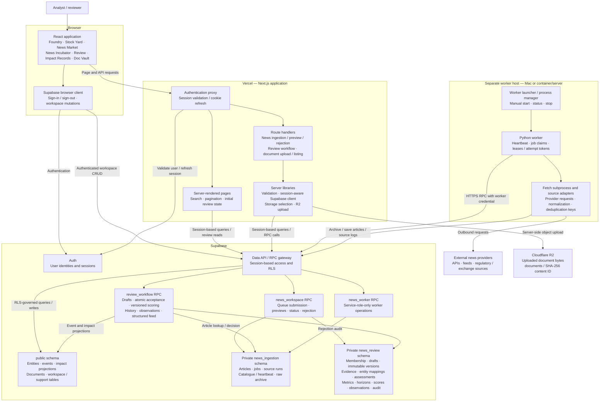
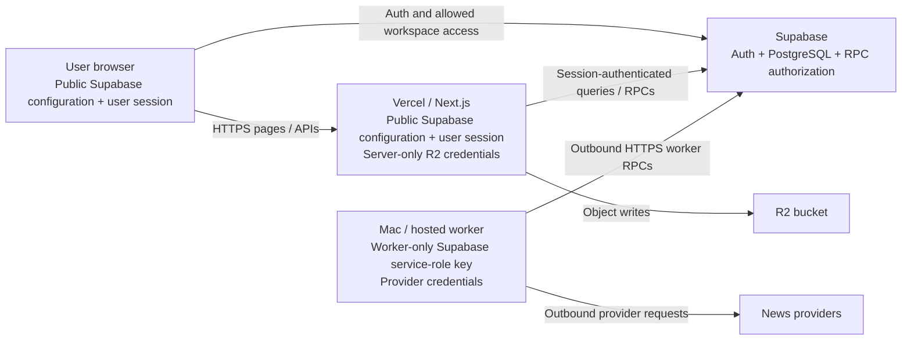
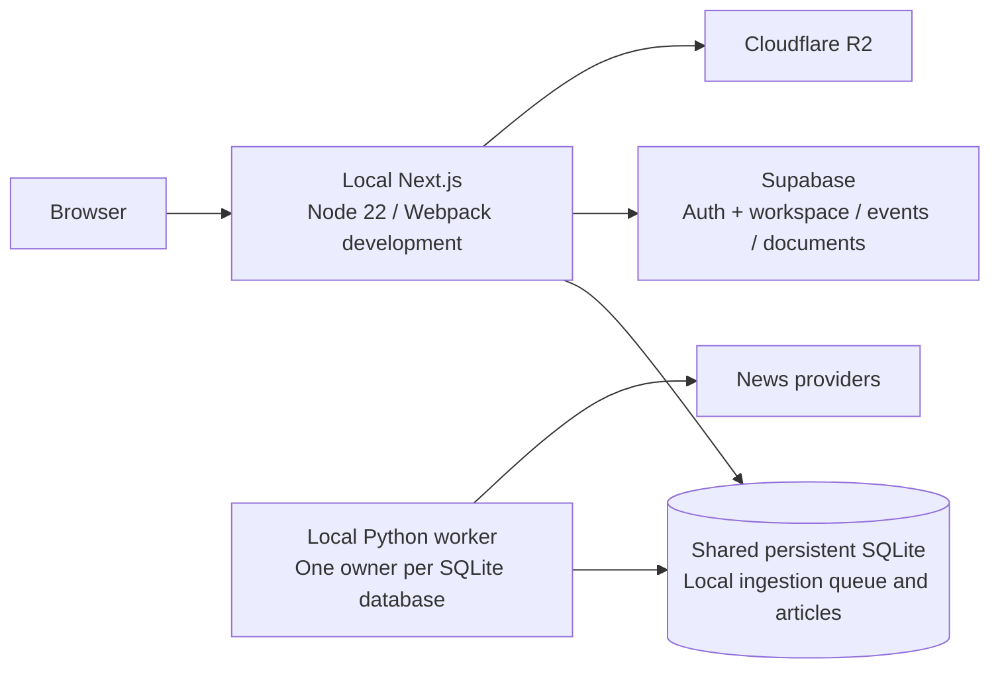

# MEIP overall architecture

Updated 2026-09-29 against the current repository implementation. This is a logical architecture of the supported deployment, not a fresh audit of live infrastructure. The primary topology is **Next.js on Vercel, Supabase for authentication and relational storage, a separately hosted Python news worker, and Cloudflare R2 for uploaded files**.

## Overall architecture

Arrows show calls or data access; responses are omitted. Private schemas are accessed through controlled RPC functions, not direct browser table queries. All application tables above reside in the same PostgreSQL database, allowing review acceptance to commit across schemas in one transaction. Supabase Auth and R2 remain separate services.

## Component responsibilities

| Component | Responsibility | Implementation |
|---|---|---|
| React UI | Browse, search, submit ingestion jobs, review news, edit workspace content, upload files | `src/app/`, `src/components/` |
| Authentication proxy | Validate sessions, refresh cookies, redirect unauthenticated page requests, reject unauthenticated API requests | `src/proxy.ts` |
| Server pages | Fetch initial state and paginated database results using the user's session | `src/app/app/`, `src/app/dev-portal/page.tsx` |
| API routes and validators | Authorize operations, check mutation origin, validate bounded inputs, invoke storage/RPC services | `src/app/api/`, `src/lib/api/` |
| Hosted ingestion RPC | Queue jobs, report readiness/status, list articles, preserve review decisions | Hosted ingestion migration and structured-review wrapper |
| Review RPC | Enforce membership/ownership, save drafts, accept atomically, score, append observations and expose history/feed | `supabase/migrations/20260929000000_structured_news_reviews.sql` |
| Worker | Publish heartbeat/catalogue, claim leased jobs, execute fetch subprocesses and report outcomes | `news_loader/worker.py`, `news_loader/hosted.py` |
| Provider adapters | Fetch source-specific data and normalize article records | `news_loader/main.py`, `news_loader/sources/` |
| Document service | Validate uploads, derive content IDs, reserve metadata, put R2 objects, finalize metadata | `src/lib/ingestion/ingest.ts`, `r2.ts` |
| Process management | Start development processes or manually manage the hosted worker on a Mac | `scripts/dev.cjs`, `worker.cjs`, `hosted-worker.cjs` |

## Data ownership and consistency

| Data | Authoritative location | Important boundary |
|---|---|---|
| User identity/session | Supabase Auth | Ordinary web requests use the signed-in identity. |
| Normalized source articles and decisions | `news_ingestion.articles` | Deduplicated independently of ticker mapping; articles survive worker restarts. |
| Ingestion execution | `news_ingestion.jobs`, `runs`, `catalogue`, `archive` | Jobs are durable; worker memory is not the queue. |
| Editable analysis | `news_review.drafts` | Owned drafts use optimistic revisions; saving does not accept news. |
| Accepted analysis and evidence | `news_review.versions` and child tables | Immutable snapshots; corrections create new versions. |
| Review observations and audit | `news_review.observations`, `audit` | Append-only records; observations do not rewrite accepted forecasts. |
| Canonical entities and securities | `public.entities`, `news_review.entity_profiles`, `securities` | Entities can exist without tickers or listed securities. |
| Searchable event representation | `public.events` | Acceptance creates or reuses an event; multiple articles can reference one event. |
| Public impact representation | `public.impact_records` | Analysis-ready acceptance creates managed projections; previous projections remain with `analysis_current = false`. |
| Uploaded document metadata | `public.document_index` | Content hash identifies a document; metadata records upload state. |
| Uploaded document bytes | Cloudflare R2 | Object writes and metadata writes are separate operations with retry recovery. |
| Foundry workspace content | `public.workspace_items` | Authenticated browser mutations are governed by RLS. |

Review acceptance atomically writes the accepted version, evidence, mappings, assessments, metrics, horizons, scores, event associations, projections, article decision and audit. Its preceding draft save is a separate transaction. The browser's score preview is advisory; the database recalculates and stores authoritative versioned scores.

The structured Impact Records feed reads the latest accepted version per article and separates analysis-ready from enrichment-pending outcomes. News Market and Stock Yard query public events/entities with impact embeds; their current queries do not filter `analysis_current`, so they can include older impact projections. Public projections do not replace immutable review history.

## Deployment and trust boundaries

- The hosted worker runs separately from Vercel. It needs outbound network access, not a public inbound HTTP endpoint or shared disk with the web app.
- The Next.js review routes do not need a service-role key. Worker credentials stay in the worker environment; locally, the worker launcher loads `.env.worker` into its subprocess environment.
- General workspace access is shared among authenticated users. New review writes require explicit reviewer/admin membership, and draft mutations additionally require ownership. Existing rejection retains its authenticated-user policy. This is not tenant-isolated architecture.
- A security-definer RPC mediates private table access and validates identity/permissions. Review tables have RLS enabled and no ordinary direct client grants. Immutable-history and projection-protection triggers add database enforcement.
- Worker readiness comes from a catalogue heartbeat refreshed approximately every minute. A heartbeat older than three minutes blocks new hosted job submissions with an offline response. Previously saved articles remain readable.
- Hosted jobs use 20-minute leases and per-attempt tokens. Expired running jobs can be reclaimed; stale attempts cannot finalize a newer attempt. Fetch subprocesses time out after 15 minutes.
- Uploaded files use a deterministic R2 key. A failed put/finalization leaves a durable reservation that can be retried with the same file; there is no distributed R2/PostgreSQL transaction.

## Optional local topology and retained legacy paths

`NEWS_STORAGE=sqlite` selects the retained local ingestion/preview/rejection storage path. This is not a fully offline application: Supabase still supplies authentication and public workspace data. SQLite requires a shared persistent filesystem and must not be used as Vercel's ephemeral storage.

**Current structured review requires hosted Supabase article storage.** Its API does not branch to SQLite. The old acceptance endpoint returns 409 directing callers to structured review; retained two-store acceptance helpers are not the current UI entry point. For the full current workflow on a Mac, use `NEWS_STORAGE=supabase` and run both Next.js and the hosted worker locally, backed by the same Supabase project.

The SQLite migration script imports articles/reviews into hosted ingestion without modifying the original file. A separate legacy reconciliation helper restores previously accepted SQLite decisions into public events when NewsFinder runs in local mode. Neither path adds an automatic cross-database replication service.

The retained `ingestAndScore` helper calls the legacy `ingest_scored_event` RPC; structured acceptance instead uses `review_workflow` and its versioned scorer. No dedicated public legacy-scoring API is implied.

## Build and operations

`npm run dev` starts Next.js with Webpack by default and launches the news worker. Standalone `worker:start`, `worker:status` and `worker:stop` support manual Mac operation. Stopping the worker preserves Supabase data and leaves an independently deployed Vercel app available.

GitHub Actions validates code and fresh-database migration contracts. A separate manually invoked workflow builds downloadable app/worker container images; it does not deploy Vercel or provision a worker host. Database migrations, web deployment and worker deployment remain separate operations.

The current architecture has no LLM enrichment service, scheduled market-observation engine, automatic document parsing, notification service, or automatic document-to-event linking. The collapsible review guide is local UI help and adds no backend service or data store.

## Related documentation

- [ER data model](er-data-model.md): tables, keys, physical and logical relationships, and recorded schema drift.
- [Sequence diagrams](sequence-diagrams.md): request order, transactions, retries and failure paths.
- [Structured news review](structured-news-review.md): reviewer setup, scoring and verification.
- [Project README](../README.md): environment setup, deployment and worker commands.

Only this documentation file was added; application code, schema and running services were not changed.
