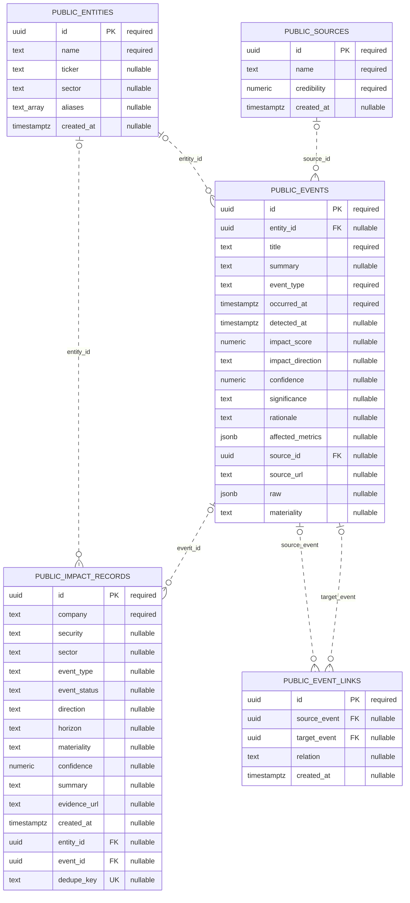
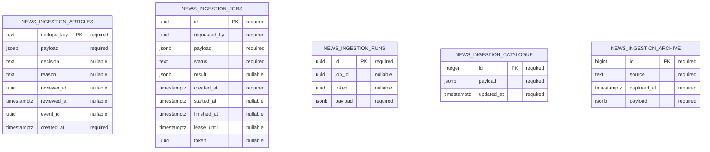
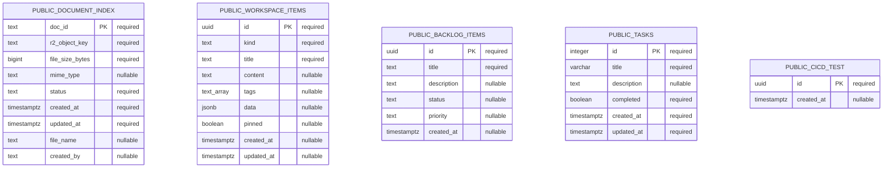
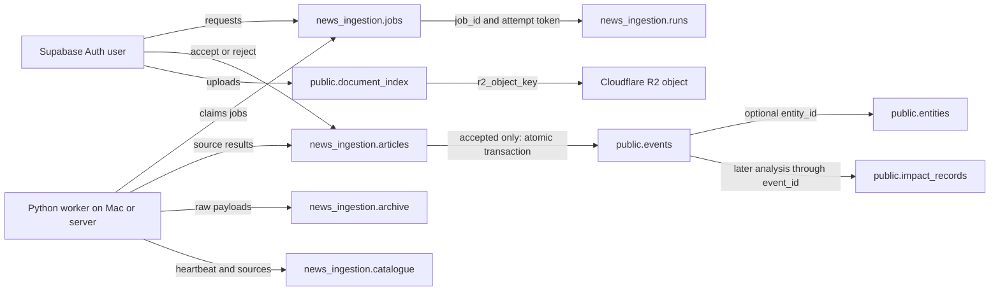

# MEIP ER data model

Verified on 2026-09-28 against the linked **meip-app-non-prod** Supabase database and the `ft_news_review_process` checkout. This describes the deployed schema, not a proposed redesign. No application data was read. There are **15 application tables: 10 in public and 5 in news_ingestion**. Supabase Auth and Cloudflare R2 are external services, not additional application tables.

## How to read this model

- PK: primary key; FK: database-enforced foreign key; UK: unique key/index. Nullable attributes explicitly say “nullable”.
- The first ER diagram contains actual database foreign keys. A child may have zero or one parent when its FK is nullable; a parent may have zero or many children.
- The ingestion and workspace diagrams intentionally contain no relationship lines: their ID fields are not foreign keys in the deployed database. Application-level links are documented separately below.
- Mermaid solid/dashed line styles describe identifying/non-identifying relationships, not whether PostgreSQL enforces them. Here all actual FK relationships are non-identifying and use dashed lines.

## Market events and analysis

## Hosted ingestion

## Documents and workspace

## Application-level relationships

These are used by the code but **are not enforced by foreign keys**. Cardinalities describe intended usage; the database can contain dangling IDs.

| From | To | Intended relationship | Database enforcement |
|---|---|---|---|
| `news_ingestion.articles.event_id` | `public.events.id` | Pending/rejected article: no event; accepted article: one event. | Nullable UUID; no FK or unique index. Multiple articles could reference one event. |
| `news_ingestion.articles.reviewer_id` | Supabase Auth user ID | One reviewer per completed review; one user can review many articles. | Nullable UUID; no FK. |
| `news_ingestion.jobs.requested_by` | Supabase Auth user ID | One requester per job; one user can request many jobs. | Required UUID; no FK. One queued/running job per requester is enforced by a partial unique index. |
| `news_ingestion.runs.job_id` | `news_ingestion.jobs.id` | One job has many per-source runs; CLI runs may have no job. | Nullable UUID; no FK. |
| `news_ingestion.runs.token` | `news_ingestion.jobs.token` | Associates a run with a specific job attempt/lease. | Nullable UUID; not a FK or unique key. |
| `public.document_index.created_by` | Supabase Auth user ID | One uploader can upload many documents. | Nullable **text**, not UUID; no FK. |
| `public.document_index.r2_object_key` | R2 object key | One indexed document points to its stored file. | Required text; no cross-service FK or DB uniqueness on object key. |

There is currently **no article-to-job or article-to-run ID**, no relational link from the raw archive to an article, and no relational link between documents and news/events. Source names inside ingestion JSON are strings, not foreign keys to `public.sources`. The flow diagram describes processing, not extra physical relationships.

## News as a first-class record

1. The worker saves each normalized article in `news_ingestion.articles`, keyed by `dedupe_key`. Its source content lives in `payload` JSONB.
2. A pending article has `decision = NULL`. Rejection sets `decision = rejected` and stores review metadata without creating an event.
3. Acceptance creates a standalone `public.events` row and records `decision = accepted` plus `event_id` in one transaction through `news_workspace('review', ...)`.
4. `events.entity_id` may remain NULL. A ticker is not required to accept news. Reported tickers are retained in JSON rather than a normalized ticker junction table.
5. Acceptance does not create an impact record. Later analysis can associate an event with multiple entities through `impact_records`. Neither the event/entity pair nor ticker itself has a uniqueness constraint.
6. NewsFinder reads `public.events`. Pending/rejected ingestion articles never enter that table through the review flow; the table can also contain other event types created by other workflows.

## JSON payload contracts

These are application conventions, not PostgreSQL column-level schemas.

| Location | Important fields |
|---|---|
| `articles.payload` | dedupe_key, source, external_id, title, url, summary, body, published_at, fetched_at, first_seen_at, publisher, language, country, tickers, isin, categories, sentiment, sentiment_label, relevance, kind, attachment_url, raw. Hosted worker stores tickers/categories as comma-separated strings and raw as serialized JSON text. |
| `events.raw` for accepted news | dedupe_key, source, publisher, published_at, fetched_at, tickers (array), body, categories, original, review.decision/reason/reviewer_id. Legacy imports may contain only the source fields that survived older cleanup. |
| `jobs.payload` | ticker, sources array, days, limit. |
| `jobs.result` | articlesNew, warnings, optional error. |
| `runs.payload` | source, job_id, token, status, started_at, finished_at, fetched, inserted, message. |
| `catalogue.payload` | sources array with adapter names, configuration readiness, and provider metadata. |
| `archive.payload` | Raw provider response; shape varies by source. |
| `workspace_items.data` | Free-form workspace metadata. |

## Constraints and lifecycle

- All 15 tables have a primary key. `articles.dedupe_key` deduplicates news independently of ticker mapping.
- `impact_records.dedupe_key` is nullable and unique when non-null. The live database has both a full unique index and a redundant partial unique index for it.
- `event_links(source_event, target_event)` is unique as a pair; PostgreSQL still permits repeated pairs containing NULL under the default NULL semantics.
- `events.entity_id` and `events.source_id`: deleting the parent sets the reference to NULL.
- Both `event_links` event references use **ON DELETE CASCADE** in the live database.
- Both `impact_records` foreign keys use default **ON DELETE NO ACTION** in the live database; a referenced entity/event cannot be deleted while those references remain.
- `articles.decision`: NULL, accepted, or rejected. SQL does not constrain decision/event_id consistency; the review function maintains it.
- `jobs.status` is required text with queued default, but has no CHECK constraint. The worker uses queued/running/succeeded/failed. A partial unique index restricts each requester to one queued/running job.
- Worker claims use a 20-minute lease and per-attempt token. `catalogue.id = 1` makes the catalogue a singleton; its timestamp is also the worker heartbeat.
- `events.materiality` allows low/medium/high (or NULL) in the live database.
- `document_index.status` allows discovered/uploading/available/failed. “duplicate” is an application response for an existing document, not a currently permitted stored status.
- Document IDs are SHA-256 content hashes in the upload implementation; R2 keys are `documents/{doc_id}`. The DB stores them as text and does not validate the hash format.
- `workspace_items`, `backlog_items`, `tasks`, and `cicd_test` have no foreign keys and are independent support tables.

## Differences from repository migrations/types

| Area | Verified deployed database | Repository definitions |
|---|---|---|
| Impact-record source fields | No headline, publisher, published_at, source, kind, tickers, sentiment_label, or raw columns. | Declared in `database.types.ts` and the news-ingest extension migration. Do not model them as deployed columns. |
| Event-link deletes | CASCADE; source/target pair also has a unique constraint. | Baseline declares SET NULL and omits the pair constraint. |
| Impact-record deletes | Default NO ACTION. | FK migration declares SET NULL. |
| Document statuses | Four stored statuses; duplicate excluded. | Migration lists duplicate too. |
| Events materiality | CHECK allows low/medium/high. | Baseline omits this CHECK. |

The generated types describe only the public schema; hosted ingestion tables are accessed through JSON-returning RPCs. Resolve schema drift through reviewed migrations rather than editing this ER document to assume all migrations are deployed.

## Legacy/local SQLite model

SQLite is a separate optional local-mode database and migration source, **not the storage used by Vercel**. Definitions are in `news_loader/storage.py` and `news_loader/queue.sql`.

| SQLite table | Primary key | Purpose / logical association |
|---|---|---|
| articles | dedupe_key | Normalized article columns; equivalent content to hosted articles.payload. |
| article_tickers | dedupe_key + ticker | Many ticker strings per article. No declared FK. |
| article_reviews | dedupe_key | Completed decision/tombstone; survives deletion of the local article. |
| review_intents | dedupe_key | Durable review reservation/payload for retrying the old two-store workflow. |
| ingestion_jobs | id | Local queue, requester, JSON payload/result, status and timestamps. |
| source_catalogue | id = 1 | Local source catalogue/heartbeat. |
| run_log | integer id | Per-source fetch logs and counts. |
| news_event_exports | dedupe_key | Tracks the Supabase event ID for an exported review; no cross-database FK. |

These SQLite associations are maintained by code; no REFERENCES clauses are declared in these table definitions. Do not merge SQLite articles/review_intents into the current hosted ER as extra Supabase tables.

## Verified column dictionary

All deployed columns are listed below. Defaults are copied from PostgreSQL metadata; blank defaults mean none declared. Identity generation may be implemented independently of column_default.

### news_ingestion.archive

| Column | SQL type | Nullable | Key | Default |
|---|---|---|---|---|
| id | bigint | No | PK | — |
| source | text | No | — | — |
| captured_at | timestamp with time zone | No | — | `now()` |
| payload | jsonb | No | — | — |

### news_ingestion.articles

| Column | SQL type | Nullable | Key | Default |
|---|---|---|---|---|
| dedupe_key | text | No | PK | — |
| payload | jsonb | No | — | — |
| decision | text | Yes | — | — |
| reason | text | Yes | — | — |
| reviewer_id | uuid | Yes | — | — |
| reviewed_at | timestamp with time zone | Yes | — | — |
| event_id | uuid | Yes | — | — |
| created_at | timestamp with time zone | No | — | `now()` |

### news_ingestion.catalogue

| Column | SQL type | Nullable | Key | Default |
|---|---|---|---|---|
| id | integer | No | PK | — |
| payload | jsonb | No | — | — |
| updated_at | timestamp with time zone | No | — | `now()` |

### news_ingestion.jobs

| Column | SQL type | Nullable | Key | Default |
|---|---|---|---|---|
| id | uuid | No | PK | `gen_random_uuid()` |
| requested_by | uuid | No | — | — |
| payload | jsonb | No | — | — |
| status | text | No | — | `'queued'::text` |
| result | jsonb | Yes | — | — |
| created_at | timestamp with time zone | No | — | `now()` |
| started_at | timestamp with time zone | Yes | — | — |
| finished_at | timestamp with time zone | Yes | — | — |
| lease_until | timestamp with time zone | Yes | — | — |
| token | uuid | Yes | — | — |

### news_ingestion.runs

| Column | SQL type | Nullable | Key | Default |
|---|---|---|---|---|
| id | uuid | No | PK | `gen_random_uuid()` |
| job_id | uuid | Yes | — | — |
| token | uuid | Yes | — | — |
| payload | jsonb | No | — | — |

### public.backlog_items

| Column | SQL type | Nullable | Key | Default |
|---|---|---|---|---|
| id | uuid | No | PK | `gen_random_uuid()` |
| title | text | No | — | — |
| description | text | Yes | — | `''::text` |
| status | text | Yes | — | `'todo'::text` |
| priority | text | Yes | — | `'medium'::text` |
| created_at | timestamp with time zone | Yes | — | `now()` |

### public.cicd_test

| Column | SQL type | Nullable | Key | Default |
|---|---|---|---|---|
| id | uuid | No | PK | `gen_random_uuid()` |
| created_at | timestamp with time zone | Yes | — | `now()` |

### public.document_index

| Column | SQL type | Nullable | Key | Default |
|---|---|---|---|---|
| doc_id | text | No | PK | — |
| r2_object_key | text | No | — | — |
| file_size_bytes | bigint | No | — | — |
| mime_type | text | Yes | — | — |
| status | text | No | — | `'discovered'::text` |
| created_at | timestamp with time zone | No | — | `now()` |
| updated_at | timestamp with time zone | No | — | `now()` |
| file_name | text | Yes | — | — |
| created_by | text | Yes | — | — |

### public.entities

| Column | SQL type | Nullable | Key | Default |
|---|---|---|---|---|
| id | uuid | No | PK | `gen_random_uuid()` |
| name | text | No | — | — |
| ticker | text | Yes | — | — |
| sector | text | Yes | — | — |
| aliases | text[] | Yes | — | `'{}'::text[]` |
| created_at | timestamp with time zone | Yes | — | `now()` |

### public.event_links

| Column | SQL type | Nullable | Key | Default |
|---|---|---|---|---|
| id | uuid | No | PK | `gen_random_uuid()` |
| source_event | uuid | Yes | FK | — |
| target_event | uuid | Yes | FK | — |
| relation | text | Yes | — | — |
| created_at | timestamp with time zone | Yes | — | `now()` |

### public.events

| Column | SQL type | Nullable | Key | Default |
|---|---|---|---|---|
| id | uuid | No | PK | `gen_random_uuid()` |
| entity_id | uuid | Yes | FK | — |
| title | text | No | — | — |
| summary | text | Yes | — | — |
| event_type | text | No | — | — |
| occurred_at | timestamp with time zone | No | — | — |
| detected_at | timestamp with time zone | Yes | — | `now()` |
| impact_score | numeric | Yes | — | — |
| impact_direction | text | Yes | — | — |
| confidence | numeric | Yes | — | — |
| significance | text | Yes | — | — |
| rationale | text | Yes | — | — |
| affected_metrics | jsonb | Yes | — | `'{}'::jsonb` |
| source_id | uuid | Yes | FK | — |
| source_url | text | Yes | — | — |
| raw | jsonb | Yes | — | — |
| materiality | text | Yes | — | `'low'::text` |

### public.impact_records

| Column | SQL type | Nullable | Key | Default |
|---|---|---|---|---|
| id | uuid | No | PK | `gen_random_uuid()` |
| company | text | No | — | — |
| security | text | Yes | — | — |
| sector | text | Yes | — | — |
| event_type | text | Yes | — | — |
| event_status | text | Yes | — | `'reported'::text` |
| direction | text | Yes | — | `'uncertain'::text` |
| horizon | text | Yes | — | `'short'::text` |
| materiality | text | Yes | — | `'medium'::text` |
| confidence | numeric | Yes | — | `0.5` |
| summary | text | Yes | — | — |
| evidence_url | text | Yes | — | — |
| created_at | timestamp with time zone | Yes | — | `now()` |
| entity_id | uuid | Yes | FK | — |
| event_id | uuid | Yes | FK | — |
| dedupe_key | text | Yes | UK | — |

### public.sources

| Column | SQL type | Nullable | Key | Default |
|---|---|---|---|---|
| id | uuid | No | PK | `gen_random_uuid()` |
| name | text | No | — | — |
| credibility | numeric | No | — | `0.5` |
| created_at | timestamp with time zone | Yes | — | `now()` |

### public.tasks

| Column | SQL type | Nullable | Key | Default |
|---|---|---|---|---|
| id | integer | No | PK | `nextval('tasks_id_seq'::regclass)` |
| title | character varying | No | — | — |
| description | text | Yes | — | — |
| completed | boolean | No | — | — |
| created_at | timestamp with time zone | No | — | `now()` |
| updated_at | timestamp with time zone | No | — | `now()` |

### public.workspace_items

| Column | SQL type | Nullable | Key | Default |
|---|---|---|---|---|
| id | uuid | No | PK | `gen_random_uuid()` |
| kind | text | No | — | `'note'::text` |
| title | text | No | — | `'Untitled'::text` |
| content | text | Yes | — | `''::text` |
| tags | text[] | Yes | — | `'{}'::text[]` |
| data | jsonb | Yes | — | `'{}'::jsonb` |
| pinned | boolean | Yes | — | `false` |
| created_at | timestamp with time zone | Yes | — | `now()` |
| updated_at | timestamp with time zone | Yes | — | `now()` |

## Sources

- Live PostgreSQL: information_schema.columns, pg_constraint, pg_indexes in public and news_ingestion (read-only inspection).
- Repository: supabase/migrations/, src/lib/database.types.ts, src/lib/ingestion/hosted.ts, src/lib/ingestion/news-event.ts, src/lib/ingestion/ingest.ts, news_loader/hosted.py, news_loader/storage.py, news_loader/queue.sql.
- This document changes no schema, policies, records, or running worker processes.

