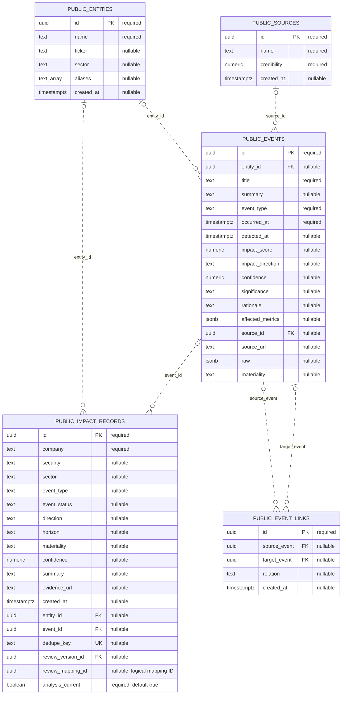
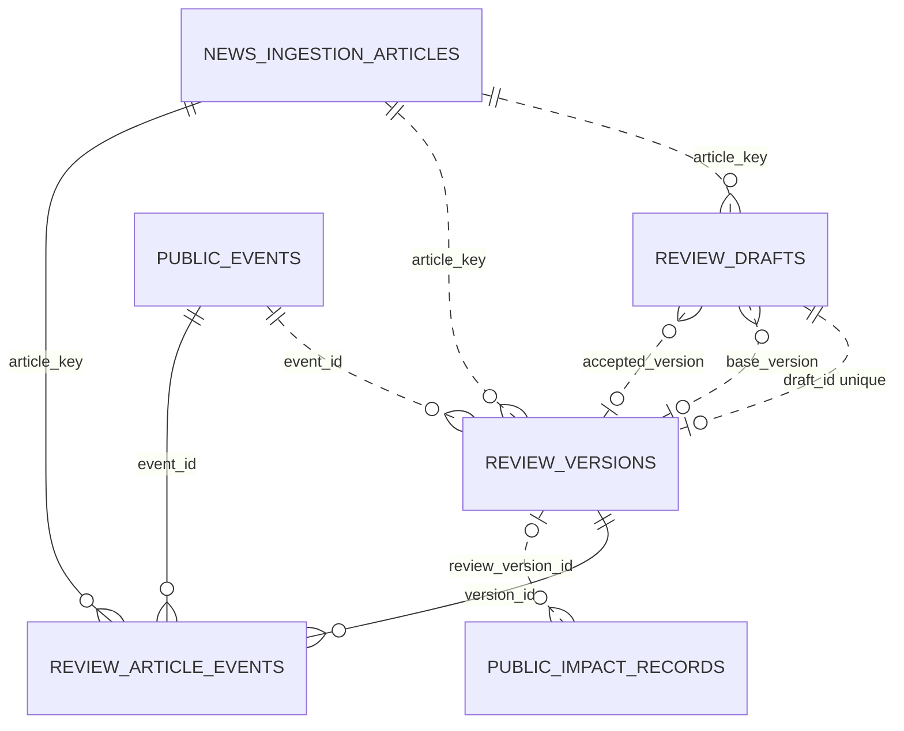
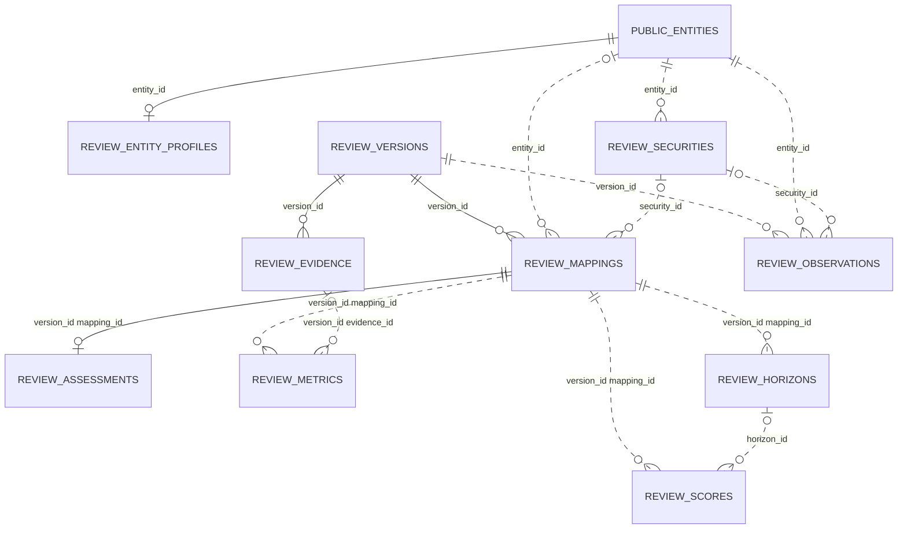
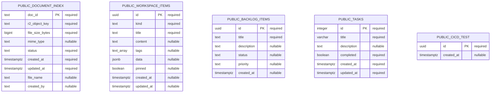
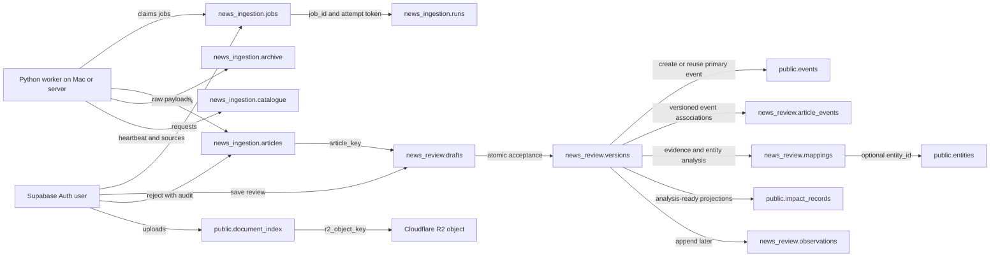

# MEIP ER data model

Updated on 2026-09-29 against the current repository migrations and review/data-access implementation. The baseline public/ingestion column dictionary and schema-drift notes retain the read-only **meip-app-non-prod** inspection from 2026-09-28; no fresh live-database inspection was performed for this update. The structured-review migration was applied to that environment during implementation. The combined model contains **30 application tables: 10 in public, 5 in news_ingestion, and 15 in news_review**. Supabase Auth and Cloudflare R2 are external services, not additional application tables.

## How to read this model

- PK: primary key; FK: database-enforced foreign key; UK: unique key/index. Nullable attributes explicitly say “nullable”.
- The ER relationship lines represent actual database foreign keys. A child may have zero or one parent when its FK is nullable; a parent may have zero or many children.
- The ingestion and workspace diagrams intentionally contain no relationship lines: their ID fields are not foreign keys in the deployed database. Application-level links are documented separately below.
- Mermaid solid/dashed line styles describe identifying/non-identifying relationships, not whether PostgreSQL enforces them. The baseline diagrams use dashed lines; the review diagrams use solid lines when the parent reference forms part of the child primary key.

## Market events and analysis



## Hosted ingestion


## Structured review: drafts and accepted history

`news_review` is a private schema, accessed through `public.review_workflow(action, args)` rather than direct client table access. Names prefixed `REVIEW_` in these diagrams belong to `news_review`; public and ingestion parents retain their schema prefixes. The diagrams show physical FK cardinalities, which can be looser than RPC validation.



- One article can have many drafts and accepted versions. An active draft is unique per `(article_key, owner_id)` while `accepted_version` and `superseded_at` are NULL. Restart preserves the previous draft with `superseded_at` populated.
- Each version comes from exactly one draft; `draft_id` is unique. `(article_key, version_no)` is also unique. The draft's nullable `base_version` records its starting point; nullable `accepted_version` records its accepted result. The latter FK is not itself unique: the RPC maintains the intended correspondence.
- Each version has one primary `event_id`. `article_events` is the versioned many-to-many article/event junction, with composite PK `(article_key, event_id, version_id)`. It also captures additional and related events. Separate FKs do not enforce that its article matches its version's article; the acceptance RPC does.
- Version snapshots preserve all submitted review sections. `published_at` and `ingested_at` on versions are nullable **text** copied from the article; `accepted_at` is a server timestamp. Occurrence time/certainty lives in the snapshot, not dedicated version columns.

## Structured review: evidence, entities and analysis



- `entity_profiles` adds entity type without changing `public.entities`. An entity may have no profile. `securities` belongs to an entity; `(entity_id, symbol, exchange)` is unique, but NULL exchanges retain PostgreSQL's default distinct-NULL behavior.
- Evidence and mappings use composite PKs `(version_id, id)`, allowing the same logical ID in successive versions. Assessments use `(version_id, mapping_id)` as both PK and FK: at most one assessment per mapping is enforced; acceptance creates one for every saved mapping.
- Metrics, horizons and scores reference mappings through composite FKs. A metric's optional evidence FK includes `version_id`, enforcing evidence from the same version. A score's optional `horizon_id` FK does **not** itself enforce matching mapping/version; the RPC supplies the consistent association.
- Mapping entity/security FKs are nullable for incomplete enrichment. The RPC validates that a selected security belongs to its entity. `chain` holds ordered causal steps and `advanced` holds scenarios/follow-up. There is no separate causal-step or scenario table.
- `horizon_defaults` stores four configured keys/labels: immediate, short_term, medium_term and long_term. `horizons.horizon` is nullable text, **not an FK** to that table; the RPC validates configured values. Dates and timing assumptions are stored in `fields`.
- Scores store the scoring version plus input/output JSON. Acceptance creates an overall score per mapping and a score per supplied horizon. The schema has no unique constraint on those score combinations; insertion behavior is controlled by the RPC.
- Observations append analysis date, cutoff, entity/security and explanatory/market-data fields to a specific accepted version. The RPC checks membership in that version's mappings, dates and evidence requirements. There is no unique daily-observation constraint, so multiple observations on the same day are possible.

`members`, `horizon_defaults` and `audit` have no foreign keys. Auth IDs in members, drafts, versions, audit and observations are logical references to Supabase Auth, not enforced auth.users FKs. Audit's article/draft/version IDs are also logical references. `impact_records.review_mapping_id` is a logical link to `mappings.id` scoped by `review_version_id`, **not a composite FK**; the version column alone is an FK.

## Documents and workspace



## Application-level relationships

These are used by the code but **are not enforced by foreign keys**. Cardinalities describe intended usage; the database can contain dangling IDs.

| From | To | Intended relationship | Database enforcement |
|---|---|---|---|
| `news_ingestion.articles.event_id` | `public.events.id` | Pending/rejected article: no event; accepted article: one event. | Nullable UUID; no FK or unique index. Multiple articles could reference one event. |
| `news_ingestion.articles.reviewer_id` | Supabase Auth user ID | One reviewer per completed review; one user can review many articles. | Nullable UUID; no FK. |
| `news_ingestion.jobs.requested_by` | Supabase Auth user ID | One requester per job; one user can request many jobs. | Required UUID; no FK. One queued/running job per requester is enforced by a partial unique index. |
| `news_ingestion.runs.job_id` | `news_ingestion.jobs.id` | One job has many per-source runs; CLI runs may have no job. | Nullable UUID; no FK. |
| `news_ingestion.runs.token` | `news_ingestion.jobs.token` | Associates a run with a specific job attempt/lease. | Nullable UUID; not a FK or unique key. |
| `public.document_index.created_by` | Supabase Auth user ID | One uploader can upload many documents. | Nullable **text**, not UUID; no FK. |
| `public.document_index.r2_object_key` | R2 object key | One indexed document points to its stored file. | Required text; no cross-service FK or DB uniqueness on object key. |



There is currently **no article-to-job or article-to-run ID**, no relational link from the raw archive to an article, and no relational link between documents and news/events. Source names inside ingestion JSON are strings, not foreign keys to `public.sources`. The flow diagram describes processing, not extra physical relationships.

## News as a first-class record

1. The worker saves each normalized article in `news_ingestion.articles`, keyed by `dedupe_key`. Its source content lives in `payload` JSONB.
2. A pending article has `decision = NULL`. Rejection sets `decision = rejected` and stores review metadata without creating an event.
3. Acceptance runs through `review_workflow('accept', ...)` using a saved draft and revision. It creates an immutable version, evidence, mappings, assessments, metrics, horizons, scores, event associations and audit in the same transaction as the article decision. The old `/api/news/accept` endpoint and old `news_workspace` acceptance action now return 409; `news_workspace` retains rejection and ingestion operations.
4. The primary event is reused from the latest accepted version, the article's legacy event ID, or the selected related event (in that order); otherwise it is created. New events leave `entity_id` NULL. Tickers are not required, and enrichment-pending acceptance permits missing mappings. Revisions do not rewrite the existing public event's headline/summary; accepted snapshots retain revised content.
5. `accepted_analysis_ready` creates one managed `public.impact_records` projection per mapping. `accepted_pending_enrichment` creates no such projections. Either outcome marks older projections for that article `analysis_current = false`; it does not delete them. The structured Impact Records feed reads the latest version per article, split by outcome. Legacy records are selected separately using `review_version_id IS NULL`.
6. NewsFinder continues to read `public.events`, so both accepted outcomes are represented there; pending/rejected articles do not create events through this workflow. Several articles can reuse one event, so NewsFinder is event-based rather than one row per accepted article. Other workflows can also create public events.
7. Unknown occurrence remains explicit in the review snapshot. When a new event needs its non-null `occurred_at`, acceptance falls back to publication time, ingestion time, then current time. That indexing timestamp must not be interpreted as verified event occurrence.

## JSON payload contracts

These are application conventions, not PostgreSQL column-level schemas.

| Location | Important fields |
|---|---|
| `articles.payload` | dedupe_key, source, external_id, title, url, summary, body, published_at, fetched_at, first_seen_at, publisher, language, country, tickers, isin, categories, sentiment, sentiment_label, relevance, kind, attachment_url, raw. Hosted worker stores tickers/categories as comma-separated strings and raw as serialized JSON text. |
| `events.raw` for newly created structured-review events | dedupe_key, source, review.decision/reviewer_id, occurrence_certainty. Existing reused events are not rewritten. Legacy accepted news can retain richer publisher/body/ticker/original/review-reason payloads from the old workflow. |
| `drafts.document` / `versions.snapshot` | verification object, evidence array (id, added_at, fields), event_ids array, mappings array (id, fields, chain, impact, metrics, horizons, advanced). See `src/lib/reviews/model.ts` and `fields.ts`. |
| Review child `fields` / mapping `advanced` | The relevant evidence, mapping, assessment, metric, horizon or observation fields from the shared specification. Mapping chain is an ordered JSON array. Optional advanced analysis includes scenarios and follow-up; it has no dedicated columns. |
| `versions.missing_analysis` | Array of analysis-ready validation messages recorded at acceptance, including for enrichment-pending versions. |
| `scores.input` / `scores.output` | Category, direction, magnitude and separate confidence inputs; deterministic score/status/significance/rationale and rule version (`review-v2.0.0`). |
| `audit.details` | Action-specific JSON metadata, not a replacement for the immutable review snapshot. |
| `jobs.payload` | ticker, sources array, days, limit. |
| `jobs.result` | articlesNew, warnings, optional error. |
| `runs.payload` | source, job_id, token, status, started_at, finished_at, fetched, inserted, message. |
| `catalogue.payload` | sources array with adapter names, configuration readiness, and provider metadata. |
| `archive.payload` | Raw provider response; shape varies by source. |
| `workspace_items.data` | Free-form workspace metadata. |

## Constraints and lifecycle

- All 30 tables have a primary key. `articles.dedupe_key` deduplicates news independently of ticker mapping.
- `impact_records.dedupe_key` is nullable and unique when non-null. The live database has both a full unique index and a redundant partial unique index for it.
- `event_links(source_event, target_event)` is unique as a pair; PostgreSQL still permits repeated pairs containing NULL under the default NULL semantics.
- `events.entity_id` and `events.source_id`: deleting the parent sets the reference to NULL.
- Both `event_links` event references use **ON DELETE CASCADE** in the live database.
- The original entity/event `impact_records` foreign keys use default **ON DELETE NO ACTION** in the live database; a referenced entity/event cannot be deleted while those references remain.
- `articles.decision`: NULL, accepted, or rejected. SQL does not constrain decision/event_id consistency; the review function maintains it.
- `jobs.status` is required text with queued default, but has no CHECK constraint. The worker uses queued/running/succeeded/failed. A partial unique index restricts each requester to one queued/running job.
- Worker claims use a 20-minute lease and per-attempt token. `catalogue.id = 1` makes the catalogue a singleton; its timestamp is also the worker heartbeat.
- `events.materiality` allows low/medium/high (or NULL) in the live database.
- `document_index.status` allows discovered/uploading/available/failed. “duplicate” is an application response for an existing document, not a currently permitted stored status.
- Document IDs are SHA-256 content hashes in the upload implementation; R2 keys are `documents/{doc_id}`. The DB stores them as text and does not validate the hash format.
- `workspace_items`, `backlog_items`, `tasks`, and `cicd_test` have no foreign keys and are independent support tables.

- All new review FKs (including `impact_records.review_version_id`) use default **ON DELETE NO ACTION**. No new cascade-delete relationships were introduced.
- Structured projections have a partial unique index on `(review_version_id, review_mapping_id)` where the version is non-null; ordinary direct modifications are rejected by a trigger. The RPC handles projection insertion and retirement.
- Immutable UPDATE/DELETE triggers protect versions, article_events, evidence, mappings, assessments, metrics, horizons, scores, audit and observations. Corrections require a new version/observation; drafts remain editable with optimistic revision checks and ownership checks.
- All 15 review tables have RLS enabled with direct PUBLIC/anon/authenticated access revoked. The security-definer RPC checks authentication and explicit reviewer/admin membership for writes; readers share accepted history, with drafts scoped to their owner. Rejection retains its previous authenticated-user policy and adds audit.
- The acceptance RPC locks the article and draft, checks the base version, and makes retries idempotent. Constraints alone do not express all these workflow rules.

## Previously verified baseline schema drift

| Area | Verified deployed database | Repository definitions |
|---|---|---|
| Impact-record source fields | No headline, publisher, published_at, source, kind, tickers, sentiment_label, or raw columns. | Declared in `database.types.ts` and the news-ingest extension migration. Do not model them as deployed columns. |
| Event-link deletes | CASCADE; source/target pair also has a unique constraint. | Baseline declares SET NULL and omits the pair constraint. |
| Impact-record deletes | Default NO ACTION. | FK migration declares SET NULL. |
| Document statuses | Four stored statuses; duplicate excluded. | Migration lists duplicate too. |
| Events materiality | CHECK allows low/medium/high. | Baseline omits this CHECK. |

These differences were observed on 2026-09-28 and were not re-queried for this documentation update. The structured-review migration does not resolve them. The application types describe only the public schema; hosted ingestion and review tables are accessed through JSON-returning RPCs. Resolve schema drift through reviewed migrations rather than editing this ER document to assume all migrations are deployed.

## Legacy/local SQLite model

SQLite is a separate optional local-mode database and migration source, **not the storage used by Vercel**. Definitions are in `news_loader/storage.py` and `news_loader/queue.sql`.

| SQLite table | Primary key | Purpose / logical association |
|---|---|---|
| articles | dedupe_key | Normalized article columns; equivalent content to hosted articles.payload. |
| article_tickers | dedupe_key + ticker | Many ticker strings per article. No declared FK. |
| article_reviews | dedupe_key | Completed decision/tombstone; survives deletion of the local article. |
| review_intents | dedupe_key | Durable review reservation/payload for retrying the old two-store workflow. |
| ingestion_jobs | id | Local queue, requester, JSON payload/result, status and timestamps. |
| source_catalogue | id = 1 | Local source catalogue/heartbeat. |
| run_log | integer id | Per-source fetch logs and counts. |
| news_event_exports | dedupe_key | Tracks the Supabase event ID for an exported review; no cross-database FK. |

These SQLite associations are maintained by code; no REFERENCES clauses are declared in these table definitions. Do not merge SQLite articles/review_intents into the current hosted ER as extra Supabase tables.

## Baseline column dictionary with current projection additions

The baseline columns below come from the prior database inspection; the three review projection columns are taken from the current migration. Defaults for baseline columns are copied from PostgreSQL metadata; blank defaults mean none declared. Identity generation may be implemented independently of column_default.

### news_ingestion.archive

| Column | SQL type | Nullable | Key | Default |
|---|---|---|---|---|
| id | bigint | No | PK | — |
| source | text | No | — | — |
| captured_at | timestamp with time zone | No | — | `now()` |
| payload | jsonb | No | — | — |

### news_ingestion.articles

| Column | SQL type | Nullable | Key | Default |
|---|---|---|---|---|
| dedupe_key | text | No | PK | — |
| payload | jsonb | No | — | — |
| decision | text | Yes | — | — |
| reason | text | Yes | — | — |
| reviewer_id | uuid | Yes | — | — |
| reviewed_at | timestamp with time zone | Yes | — | — |
| event_id | uuid | Yes | — | — |
| created_at | timestamp with time zone | No | — | `now()` |

### news_ingestion.catalogue

| Column | SQL type | Nullable | Key | Default |
|---|---|---|---|---|
| id | integer | No | PK | — |
| payload | jsonb | No | — | — |
| updated_at | timestamp with time zone | No | — | `now()` |

### news_ingestion.jobs

| Column | SQL type | Nullable | Key | Default |
|---|---|---|---|---|
| id | uuid | No | PK | `gen_random_uuid()` |
| requested_by | uuid | No | — | — |
| payload | jsonb | No | — | — |
| status | text | No | — | `'queued'::text` |
| result | jsonb | Yes | — | — |
| created_at | timestamp with time zone | No | — | `now()` |
| started_at | timestamp with time zone | Yes | — | — |
| finished_at | timestamp with time zone | Yes | — | — |
| lease_until | timestamp with time zone | Yes | — | — |
| token | uuid | Yes | — | — |

### news_ingestion.runs

| Column | SQL type | Nullable | Key | Default |
|---|---|---|---|---|
| id | uuid | No | PK | `gen_random_uuid()` |
| job_id | uuid | Yes | — | — |
| token | uuid | Yes | — | — |
| payload | jsonb | No | — | — |

### public.backlog_items

| Column | SQL type | Nullable | Key | Default |
|---|---|---|---|---|
| id | uuid | No | PK | `gen_random_uuid()` |
| title | text | No | — | — |
| description | text | Yes | — | `''::text` |
| status | text | Yes | — | `'todo'::text` |
| priority | text | Yes | — | `'medium'::text` |
| created_at | timestamp with time zone | Yes | — | `now()` |

### public.cicd_test

| Column | SQL type | Nullable | Key | Default |
|---|---|---|---|---|
| id | uuid | No | PK | `gen_random_uuid()` |
| created_at | timestamp with time zone | Yes | — | `now()` |

### public.document_index

| Column | SQL type | Nullable | Key | Default |
|---|---|---|---|---|
| doc_id | text | No | PK | — |
| r2_object_key | text | No | — | — |
| file_size_bytes | bigint | No | — | — |
| mime_type | text | Yes | — | — |
| status | text | No | — | `'discovered'::text` |
| created_at | timestamp with time zone | No | — | `now()` |
| updated_at | timestamp with time zone | No | — | `now()` |
| file_name | text | Yes | — | — |
| created_by | text | Yes | — | — |

### public.entities

| Column | SQL type | Nullable | Key | Default |
|---|---|---|---|---|
| id | uuid | No | PK | `gen_random_uuid()` |
| name | text | No | — | — |
| ticker | text | Yes | — | — |
| sector | text | Yes | — | — |
| aliases | text[] | Yes | — | `'{}'::text[]` |
| created_at | timestamp with time zone | Yes | — | `now()` |

### public.event_links

| Column | SQL type | Nullable | Key | Default |
|---|---|---|---|---|
| id | uuid | No | PK | `gen_random_uuid()` |
| source_event | uuid | Yes | FK | — |
| target_event | uuid | Yes | FK | — |
| relation | text | Yes | — | — |
| created_at | timestamp with time zone | Yes | — | `now()` |

### public.events

| Column | SQL type | Nullable | Key | Default |
|---|---|---|---|---|
| id | uuid | No | PK | `gen_random_uuid()` |
| entity_id | uuid | Yes | FK | — |
| title | text | No | — | — |
| summary | text | Yes | — | — |
| event_type | text | No | — | — |
| occurred_at | timestamp with time zone | No | — | — |
| detected_at | timestamp with time zone | Yes | — | `now()` |
| impact_score | numeric | Yes | — | — |
| impact_direction | text | Yes | — | — |
| confidence | numeric | Yes | — | — |
| significance | text | Yes | — | — |
| rationale | text | Yes | — | — |
| affected_metrics | jsonb | Yes | — | `'{}'::jsonb` |
| source_id | uuid | Yes | FK | — |
| source_url | text | Yes | — | — |
| raw | jsonb | Yes | — | — |
| materiality | text | Yes | — | `'low'::text` |

### public.impact_records

| Column | SQL type | Nullable | Key | Default |
|---|---|---|---|---|
| id | uuid | No | PK | `gen_random_uuid()` |
| company | text | No | — | — |
| security | text | Yes | — | — |
| sector | text | Yes | — | — |
| event_type | text | Yes | — | — |
| event_status | text | Yes | — | `'reported'::text` |
| direction | text | Yes | — | `'uncertain'::text` |
| horizon | text | Yes | — | `'short'::text` |
| materiality | text | Yes | — | `'medium'::text` |
| confidence | numeric | Yes | — | `0.5` |
| summary | text | Yes | — | — |
| evidence_url | text | Yes | — | — |
| created_at | timestamp with time zone | Yes | — | `now()` |
| entity_id | uuid | Yes | FK | — |
| event_id | uuid | Yes | FK | — |
| dedupe_key | text | Yes | UK | — |
| review_version_id | uuid | Yes | FK; part of partial UK | — |
| review_mapping_id | uuid | Yes | Part of partial UK; no FK | — |
| analysis_current | boolean | No | — | `true` |

### public.sources

| Column | SQL type | Nullable | Key | Default |
|---|---|---|---|---|
| id | uuid | No | PK | `gen_random_uuid()` |
| name | text | No | — | — |
| credibility | numeric | No | — | `0.5` |
| created_at | timestamp with time zone | Yes | — | `now()` |

### public.tasks

| Column | SQL type | Nullable | Key | Default |
|---|---|---|---|---|
| id | integer | No | PK | `nextval('tasks_id_seq'::regclass)` |
| title | character varying | No | — | — |
| description | text | Yes | — | — |
| completed | boolean | No | — | — |
| created_at | timestamp with time zone | No | — | `now()` |
| updated_at | timestamp with time zone | No | — | `now()` |

### public.workspace_items

| Column | SQL type | Nullable | Key | Default |
|---|---|---|---|---|
| id | uuid | No | PK | `gen_random_uuid()` |
| kind | text | No | — | `'note'::text` |
| title | text | No | — | `'Untitled'::text` |
| content | text | Yes | — | `''::text` |
| tags | text[] | Yes | — | `'{}'::text[]` |
| data | jsonb | Yes | — | `'{}'::jsonb` |
| pinned | boolean | Yes | — | `false` |
| created_at | timestamp with time zone | Yes | — | `now()` |
| updated_at | timestamp with time zone | Yes | — | `now()` |

## Review column dictionary (migration DDL)

The declarations below list **every column**, SQL type, nullability, default, primary/unique key and inline/composite FK for the 15 new tables. A column without `NOT NULL` or `PRIMARY KEY` is nullable; omitted defaults mean no declared default. The two draft/version FKs added afterward are included. Indexes, triggers and access rules are explained above; the migration is the executable source of truth.

### news_review.members

```sql
CREATE TABLE news_review.members (
  user_id uuid PRIMARY KEY,
  role text NOT NULL CHECK(role IN ('reviewer','admin'))
);
```

### news_review.entity_profiles

```sql
CREATE TABLE news_review.entity_profiles (
  entity_id uuid PRIMARY KEY REFERENCES public.entities(id),
  entity_type text NOT NULL CHECK(entity_type IN ('company','sector','industry','commodity','country','index','other'))
);
```

### news_review.securities

```sql
CREATE TABLE news_review.securities (
  id uuid PRIMARY KEY DEFAULT gen_random_uuid(),
  entity_id uuid NOT NULL REFERENCES public.entities(id),
  symbol text NOT NULL,
  exchange text,
  UNIQUE(entity_id,symbol,exchange)
);
```

### news_review.horizon_defaults

```sql
CREATE TABLE news_review.horizon_defaults (
  key text PRIMARY KEY,
  label text NOT NULL
);
```

### news_review.drafts

```sql
CREATE TABLE news_review.drafts (
  id uuid PRIMARY KEY DEFAULT gen_random_uuid(),
  article_key text NOT NULL REFERENCES news_ingestion.articles(dedupe_key),
  owner_id uuid NOT NULL,
  revision int NOT NULL DEFAULT 0,
  document jsonb NOT NULL,
  base_version uuid,
  accepted_version uuid,
  superseded_at timestamptz,
  created_at timestamptz NOT NULL DEFAULT now(),
  updated_at timestamptz NOT NULL DEFAULT now()
);
```

After `versions` exists:

```sql
ALTER TABLE news_review.drafts
  ADD FOREIGN KEY (base_version) REFERENCES news_review.versions(id),
  ADD FOREIGN KEY (accepted_version) REFERENCES news_review.versions(id);
```

### news_review.versions

```sql
CREATE TABLE news_review.versions (
  id uuid PRIMARY KEY DEFAULT gen_random_uuid(),
  article_key text NOT NULL REFERENCES news_ingestion.articles(dedupe_key),
  draft_id uuid NOT NULL UNIQUE REFERENCES news_review.drafts(id),
  version_no int NOT NULL,
  outcome text NOT NULL CHECK(outcome IN ('accepted_pending_enrichment','accepted_analysis_ready')),
  event_id uuid NOT NULL REFERENCES public.events(id),
  snapshot jsonb NOT NULL,
  missing_analysis jsonb NOT NULL,
  accepted_by uuid NOT NULL,
  accepted_at timestamptz NOT NULL DEFAULT now(),
  published_at text,
  ingested_at text,
  UNIQUE(article_key,version_no)
);
```

### news_review.article_events

```sql
CREATE TABLE news_review.article_events (
  article_key text NOT NULL REFERENCES news_ingestion.articles(dedupe_key),
  event_id uuid NOT NULL REFERENCES public.events(id),
  version_id uuid NOT NULL REFERENCES news_review.versions(id),
  PRIMARY KEY(article_key,event_id,version_id)
);
```

### news_review.evidence

```sql
CREATE TABLE news_review.evidence (
  id uuid NOT NULL,
  version_id uuid NOT NULL REFERENCES news_review.versions(id),
  fields jsonb NOT NULL,
  added_at timestamptz NOT NULL,
  PRIMARY KEY(version_id,id)
);
```

### news_review.mappings

```sql
CREATE TABLE news_review.mappings (
  id uuid NOT NULL,
  version_id uuid NOT NULL REFERENCES news_review.versions(id),
  entity_id uuid REFERENCES public.entities(id),
  security_id uuid REFERENCES news_review.securities(id),
  fields jsonb NOT NULL,
  chain jsonb NOT NULL,
  advanced jsonb NOT NULL,
  PRIMARY KEY(version_id,id)
);
```

### news_review.assessments

```sql
CREATE TABLE news_review.assessments (
  version_id uuid NOT NULL,
  mapping_id uuid NOT NULL,
  fields jsonb NOT NULL,
  PRIMARY KEY(version_id,mapping_id),
  FOREIGN KEY(version_id,mapping_id) REFERENCES news_review.mappings(version_id,id)
);
```

### news_review.metrics

```sql
CREATE TABLE news_review.metrics (
  id uuid PRIMARY KEY DEFAULT gen_random_uuid(),
  version_id uuid NOT NULL,
  mapping_id uuid NOT NULL,
  fields jsonb NOT NULL,
  evidence_id uuid,
  FOREIGN KEY(version_id,mapping_id) REFERENCES news_review.mappings(version_id,id),
  FOREIGN KEY(version_id,evidence_id) REFERENCES news_review.evidence(version_id,id)
);
```

### news_review.horizons

```sql
CREATE TABLE news_review.horizons (
  id uuid PRIMARY KEY DEFAULT gen_random_uuid(),
  version_id uuid NOT NULL,
  mapping_id uuid NOT NULL,
  horizon text,
  fields jsonb NOT NULL,
  FOREIGN KEY(version_id,mapping_id) REFERENCES news_review.mappings(version_id,id)
);
```

### news_review.scores

```sql
CREATE TABLE news_review.scores (
  id uuid PRIMARY KEY DEFAULT gen_random_uuid(),
  version_id uuid NOT NULL,
  mapping_id uuid NOT NULL,
  horizon_id uuid REFERENCES news_review.horizons(id),
  scoring_version text NOT NULL,
  input jsonb NOT NULL,
  output jsonb NOT NULL,
  FOREIGN KEY(version_id,mapping_id) REFERENCES news_review.mappings(version_id,id)
);
```

### news_review.audit

```sql
CREATE TABLE news_review.audit (
  id bigint GENERATED ALWAYS AS IDENTITY PRIMARY KEY,
  actor_id uuid NOT NULL,
  action text NOT NULL,
  article_key text,
  draft_id uuid,
  version_id uuid,
  details jsonb NOT NULL DEFAULT '{}',
  created_at timestamptz NOT NULL DEFAULT now()
);
```

### news_review.observations

```sql
CREATE TABLE news_review.observations (
  id uuid PRIMARY KEY DEFAULT gen_random_uuid(),
  version_id uuid NOT NULL REFERENCES news_review.versions(id),
  entity_id uuid NOT NULL REFERENCES public.entities(id),
  security_id uuid REFERENCES news_review.securities(id),
  analysis_date date NOT NULL,
  cutoff_at timestamptz NOT NULL,
  fields jsonb NOT NULL,
  created_by uuid NOT NULL,
  created_at timestamptz NOT NULL DEFAULT now()
);
```

## Sources

- Prior live PostgreSQL inspection (2026-09-28; not repeated in this update): information_schema.columns, pg_constraint, pg_indexes in public and news_ingestion (read-only inspection).
- Repository: supabase/migrations/, src/lib/database.types.ts, src/lib/ingestion/hosted.ts, src/lib/ingestion/news-event.ts, src/lib/ingestion/ingest.ts, news_loader/hosted.py, news_loader/storage.py, news_loader/queue.sql.
- Current review sources: `supabase/migrations/20260929000000_structured_news_reviews.sql`, `src/lib/reviews/{api,model,fields}.ts`, `src/app/api/news/reviews/route.ts`, `src/app/api/news/accept/route.ts`, `src/app/app/impact/StructuredImpacts.tsx`, and [structured review setup](structured-news-review.md). The collapsible review guide uses the same field contract and adds no storage tables.
- This document changes no schema, policies, records, or running worker processes.

