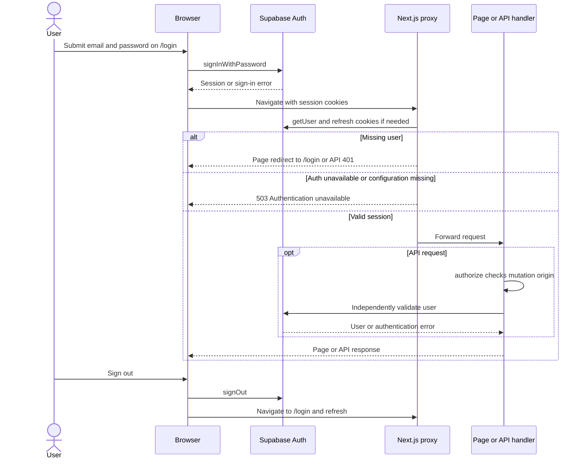
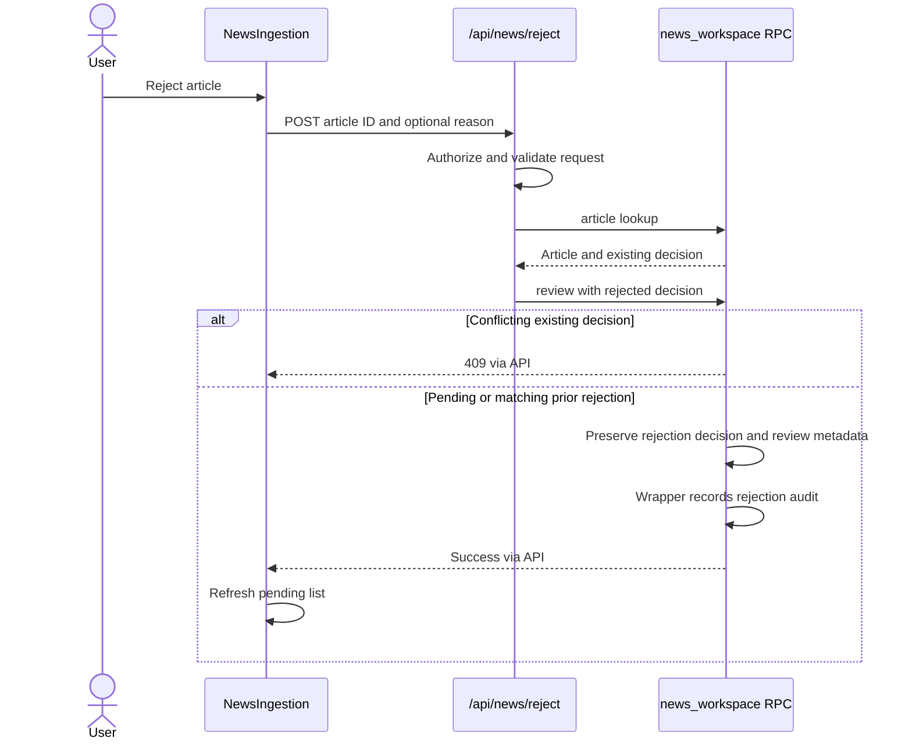
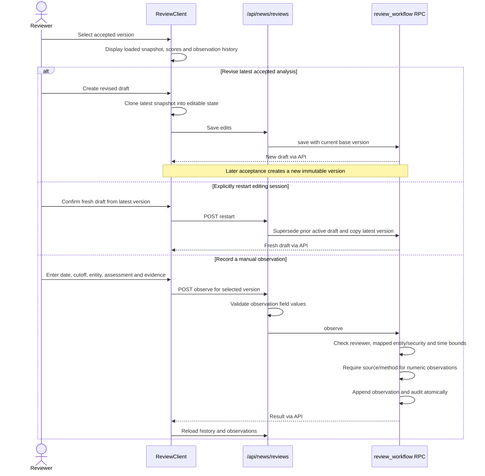
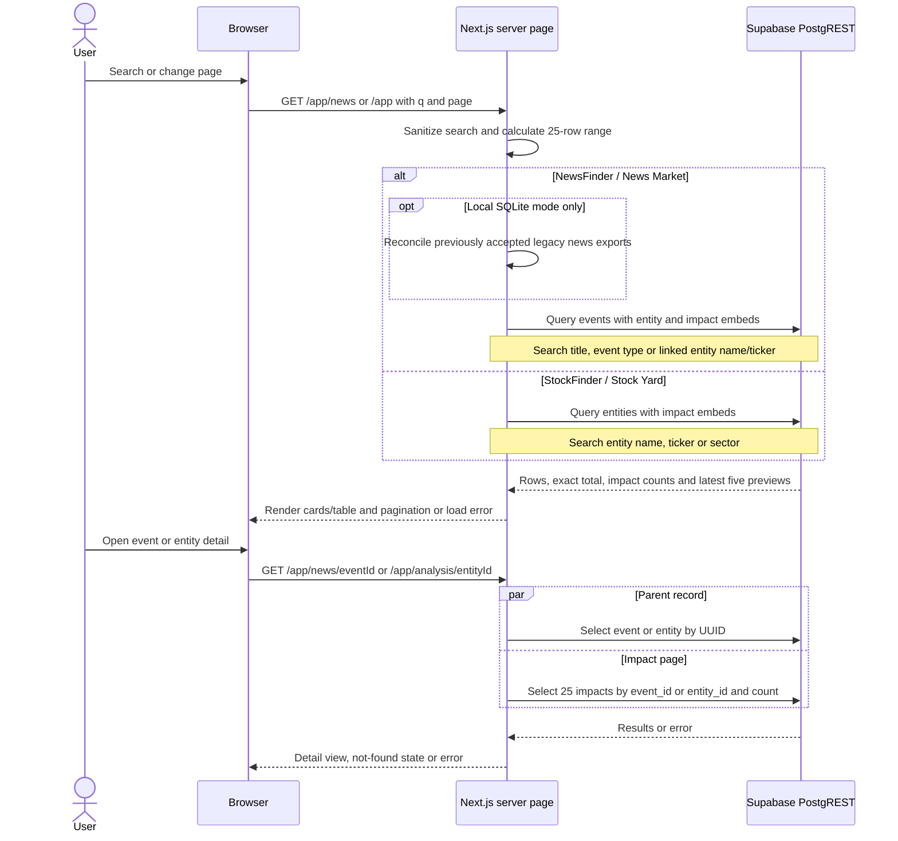
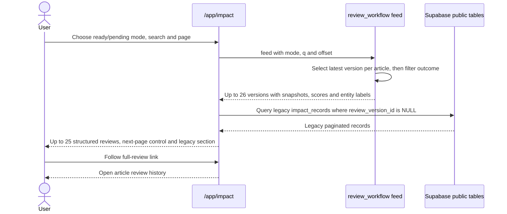
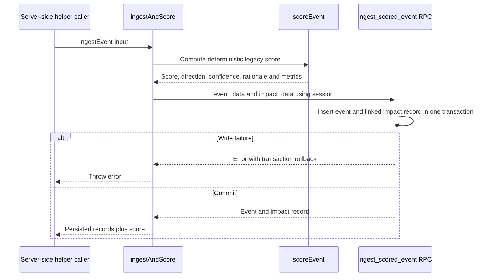
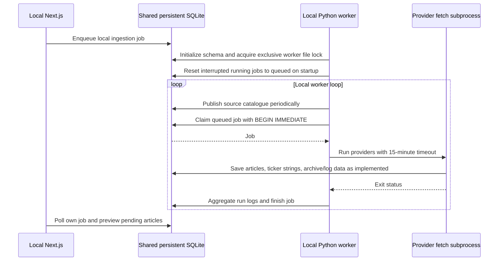
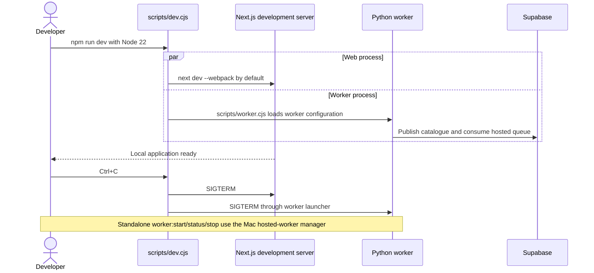

# MEIP sequence diagrams

Verified against the repository implementation on 2026-09-29. These diagrams describe current code paths, not proposed integrations or a fresh live-environment audit. Read alongside the [ER data model](er-data-model.md) and [structured review guide](structured-news-review.md).

Each diagram is Mermaid source and can be viewed in a Markdown renderer with Mermaid support. Dashed arrows are responses; `alt` denotes alternatives, `loop` repetition, and `par` independent work. A database self-call describes work inside the named RPC, not a separate HTTP request. Database transactions do not extend across external provider or R2 calls.

## Workflow index

1. [Sign-in, request authorization and sign-out](#1-sign-in-request-authorization-and-sign-out)
2. [News workspace loading and job submission](#2-news-workspace-loading-and-job-submission)
3. [Hosted worker execution and recovery](#3-hosted-worker-execution-and-recovery)
4. [Review loading, editing and saving](#4-review-loading-editing-and-saving)
5. [Atomic acceptance and versioned scoring](#5-atomic-acceptance-and-versioned-scoring)
6. [Rejection](#6-rejection)
7. [History, revisions and manual observations](#7-history-revisions-and-manual-observations)
8. [NewsFinder, StockFinder and detail pages](#8-newsfinder-stockfinder-and-detail-pages)
9. [Impact Records](#9-impact-records)
10. [Document upload and listing](#10-document-upload-and-listing)
11. [Foundry workspace editing](#11-foundry-workspace-editing)
12. [Legacy scoring helper](#12-legacy-scoring-helper)
13. [Local SQLite mode and migration](#13-local-sqlite-mode-and-migration)
14. [Development, worker lifecycle and CI](#14-development-worker-lifecycle-and-ci)

## 1. Sign-in, request authorization and sign-out



Authenticated visits to `/login` redirect to `/dev-portal`. Mutating APIs reject cross-site or mismatched-origin requests. Ordinary data access uses the signed-in user's Supabase session and RLS; new review writes additionally require explicit reviewer membership. The worker alone uses its service-role credential. General workspace access is shared, not tenant-isolated.

Sources: `src/app/login/page.tsx`, `src/proxy.ts`, `src/lib/api/auth.ts`, `src/components/Shell.tsx`.

## 2. News workspace loading and job submission

```mermaid
sequenceDiagram
    actor User
    participant UI as NewsIngestion browser
    participant API as Next.js news APIs
    participant DB as Supabase RPCs
    par Source readiness
        UI->>API: GET /api/news/sources
        API->>DB: news_workspace sources
        DB-->>UI: Source catalogue or offline error via API
    and Pending articles
        UI->>API: GET /api/news/preview with filters and pagination
        API->>DB: news_workspace preview
        DB-->>UI: Pending articles via API
    and Resume state
        UI->>API: GET /api/news/ingest and GET /api/news/reviews
        API->>DB: news_workspace job and review_workflow drafts
        DB-->>UI: Own latest job and draft references via API
    end
    User->>UI: Choose ticker, sources, days and limit; fetch
    UI->>API: POST /api/news/ingest
    API->>API: Authorize and validate bounded JSON
    API->>DB: news_workspace enqueue
    alt Catalogue heartbeat older than three minutes
        DB-->>UI: 503 worker offline via API
    else Requester already has queued or running job
        DB-->>UI: 409 active job via API
    else Ready
        DB->>DB: Insert durable queued job for auth.uid
        DB-->>UI: 202 with job ID via API
        loop Until job finishes or page stops polling
            UI->>API: GET /api/news/ingest?id=jobId
            API->>DB: news_workspace job scoped to requester
            DB-->>UI: Status and result via API
        end
        UI->>API: Refresh pending article preview
    end
```

Submission does not execute Python inside Next.js. Existing articles can be read while the hosted worker is stopped; fetching new news requires its recent heartbeat. Reloading the page can reconnect to the latest job. API validation/authentication failures return without enqueueing.

Sources: `src/app/app/news-ingestion/NewsIngestionClient.tsx`, `src/app/api/news/{sources,preview,ingest,reviews}/route.ts`, `src/lib/ingestion/hosted.ts`.

## 3. Hosted worker execution and recovery

```mermaid
sequenceDiagram
    participant Worker as Python hosted worker
    participant Fetch as main.py and source adapters
    participant Provider as External news providers
    participant DB as news_worker RPC / private ingestion tables
    Worker->>Fetch: List configured sources
    Fetch-->>Worker: Catalogue JSON
    Worker->>DB: catalogue using worker credential
    par Heartbeat thread
        loop Every 60 seconds
            Worker->>DB: Refresh catalogue and readiness timestamp
        end
    and Job consumer
        loop Claim work; idle wait three seconds
            Worker->>DB: claim
            DB->>DB: Lock queued or expired-running job with SKIP LOCKED
            DB->>DB: Set running, 20-minute lease, new attempt token
            DB-->>Worker: Claimed job or no work
            opt Job claimed
                Worker->>Fetch: Run fetch subprocess with job ID and token
                loop Selected source adapters
                    Fetch->>DB: run_start
                    Fetch->>Provider: Fetch news
                    Provider-->>Fetch: Source response or error
                    opt Adapter supplies raw data
                        Fetch->>DB: archive raw provider payload
                    end
                    Fetch->>Fetch: Normalize articles and compute dedupe keys
                    Fetch->>DB: save article batches up to 50
                    DB->>DB: Deduplicate and preserve completed decisions
                    Fetch->>DB: run_finish with counts and status
                end
                Fetch-->>Worker: Exit status or 15-minute timeout
                Worker->>DB: logs for current job and token
                Worker->>Worker: Aggregate new counts and source warnings
                Worker->>DB: finish with success/result and attempt token
                DB->>DB: Update only matching running attempt
            end
        end
    end
    Note over Worker,DB: Crashed attempts become claimable after lease expiry; stale tokens cannot finish a newer attempt.
```

Success requires subprocess exit code zero and at least one successful source. Individual source failures appear as warnings; no successful source makes the job fail. Worker-loop exceptions are logged and retried after ten seconds. This is lease-based recovery, not a claim of exactly-once provider fetching.

Sources: `news_loader/{hosted,main,registry}.py`, `news_loader/sources/`, `supabase/migrations/20260928000000_hosted_news_ingestion.sql`.

## 4. Review loading, editing and saving

```mermaid
sequenceDiagram
    actor Reviewer
    participant UI as Review page and client
    participant API as /api/news/reviews
    participant DB as review_workflow RPC
    Reviewer->>UI: Open Review / Accept for article key
    UI->>DB: Server page calls load with session
    DB-->>UI: Article, own draft, accepted history, entities, securities, horizons
    UI->>UI: Initialize from draft, latest snapshot or article prefills
    Reviewer->>UI: Edit verification, evidence, mappings, impact and horizons
    opt Expand review guide
        UI->>UI: Show current-step field meanings and examples locally
    end
    opt Canonical entity or security is missing
        UI->>API: POST entity or security
        API->>DB: Validate membership and create canonical record with audit
        DB-->>UI: Created ID via API
        UI->>API: Reload available entities and securities
    end
    Reviewer->>UI: Save draft
    UI->>UI: Validate document shape and field values
    UI->>API: POST save with document, draft ID and revision
    API->>API: Authorize, limit body to 256 KB, validate
    API->>DB: save
    DB->>DB: Check reviewer membership, ownership and revision
    alt Invalid, unauthorized or stale revision
        DB-->>UI: Actionable error via API; keep local edits
    else Valid save
        DB->>DB: Store document, advance revision and record audit
        DB-->>UI: Saved draft via API
        UI->>UI: Clear unsaved state
    end
```

Incomplete drafts are supported; saving is not acceptance. Navigating away with unsaved draft or observation changes prompts the reviewer. The guide exists only during editable acceptance and makes no network writes. Creating entities/securities is a separate transaction and is not undone by abandoning the draft.

Sources: `src/app/app/news-review/[article]/{page,ReviewClient}.tsx`, `src/components/ReviewGuide.tsx`, `src/lib/reviews/`, `src/app/api/news/reviews/route.ts`.

## 5. Atomic acceptance and versioned scoring

```mermaid
sequenceDiagram
    actor Reviewer
    participant UI as ReviewClient
    participant API as /api/news/reviews
    participant DB as review_workflow accept
    Reviewer->>UI: Accept pending enrichment or analysis ready
    UI->>UI: Validate outcome requirements and preview rule scores
    opt Unsaved changes or no saved draft
        UI->>API: Save draft
        API->>DB: save
        DB-->>UI: Draft ID and revision via API
    end
    UI->>API: POST accept with draft ID, revision and outcome
    API->>DB: accept using signed-in session
    DB->>DB: Check reviewer, lock article and draft, check ownership
    alt Same draft already accepted with same outcome
        DB-->>UI: Existing version ID via API
    else Conflicting outcome, stale revision or stale base version
        DB-->>UI: 409 via API
    else Eligible draft
        DB->>DB: Validate outcome and compute missing analysis
        Note over DB: Following writes belong to one database transaction
        DB->>DB: Reuse primary event or insert public.events
        DB->>DB: Insert immutable version and article-event associations
        DB->>DB: Insert evidence, mappings, assessments and metrics
        DB->>DB: Compute and store versioned mapping and horizon scores
        DB->>DB: Mark older impact projections noncurrent
        opt Outcome is analysis ready
            DB->>DB: Insert one managed impact projection per mapping
        end
        DB->>DB: Mark article accepted, link draft and append audit
        alt Any validation or write failure
            DB-->>API: Error; transaction rolls back
            API-->>UI: Error; saved draft remains available
        else Commit succeeds
            DB-->>UI: Accepted version and event IDs via API
            UI->>API: Reload article and immutable history
            UI->>UI: End editing and show accepted version
        end
    end
```

Both outcomes make accepted news available through public events. Ticker links are optional; enrichment-pending acceptance can lack entity analysis. Ready acceptance needs complete analysis. Server scoring is authoritative (`review-v2.0.0`); unsupported/unknown inputs remain unscored. The earlier draft save is a separate committed transaction. Related events and revised articles can reuse a public event instead of creating a new one; versions preserve the changed review content.

The old `POST /api/news/accept` and hosted `news_workspace` acceptance action return 409 directing callers to this workflow.

Sources: `src/lib/reviews/model.ts`, `src/lib/scoring/index.ts`, `supabase/migrations/20260929000000_structured_news_reviews.sql`.

## 6. Rejection



Rejection retains its authenticated-user policy; it does not require the new reviewer role. No event, accepted version or impact projection is created. A conflicting existing decision can also be caught in the API helper before the write RPC.

Sources: `src/app/api/news/reject/route.ts`, `src/lib/ingestion/{review,hosted}.ts`, structured-review migration's `news_workspace` wrapper.

## 7. History, revisions and manual observations



Observations never rewrite accepted forecasts. No market prices, scheduled observations or automatic score decay are generated. Immutable-table triggers reject updates/deletes of accepted history; revision and observation failures leave that history intact.

## 8. NewsFinder, StockFinder and detail pages



News search uses an embedded PostgREST query, **not** `search_event_ids`. NewsFinder lists events, not pending/rejected ingestion rows. Stock/news previews and their detail queries currently do **not** filter `analysis_current`; historical structured projections can appear there. The latest-version filtering belongs to the dedicated structured Impact Records feed below.

Sources: `src/lib/{queries,news-query}.ts`, `src/app/app/page.tsx`, `src/app/app/news/page.tsx`, event/entity detail pages.

## 9. Impact Records



Ready and pending feeds are distinct. If a newer version is pending, an older ready version does not remain in the ready feed. The structured UI reads immutable versions/scores rather than reconstructing analysis from public projections.

Sources: `src/app/app/impact/{page,StructuredImpacts}.tsx` and the review RPC `feed` action.

## 10. Document upload and listing

```mermaid
sequenceDiagram
    actor User
    participant UI as Doc Vault
    participant API as /api/ingest
    participant DB as Supabase document_index
    participant R2 as Cloudflare R2
    User->>UI: Select file and upload
    UI->>API: POST multipart file
    API->>API: Authorize; bound request; validate size, extension and MIME
    API->>API: SHA-256 bytes to doc_id; key documents/doc_id
    API->>DB: Reserve uploading row; ignore duplicate doc_id
    API->>DB: Read stored status
    alt Already available
        API-->>UI: 409 duplicate document
    else New or unfinished upload
        API->>R2: PutObject using deterministic content key
        alt Storage call fails
            API-->>UI: Error; uploading reservation remains
        else Object stored
            API->>DB: Finalize status available
            alt Database finalization fails
                API-->>UI: Error; retry same file to finish
            else Finalized
                API-->>UI: 200 success with doc_id
            end
        end
    end
    UI->>API: GET /api/ingest?page=N
    API->>DB: Read 25 documents and exact count
    DB-->>UI: File metadata/status and hasMore via API
```

Maximum file size is 20 MB. Validation is metadata/size validation, not malware scanning or document parsing. R2 and PostgreSQL do not share a transaction; deterministic keys and durable reservations support retries. Uploading does not automatically extract text or connect documents to news events.

Sources: `src/app/app/upload/page.tsx`, `src/app/api/ingest/route.ts`, `src/lib/ingestion/{ingest,upload-validation,r2}.ts`.

## 11. Foundry workspace editing

```mermaid
sequenceDiagram
    actor User
    participant Page as /dev-portal server page
    participant UI as DevPortalClient
    participant DB as Supabase workspace_items with RLS
    User->>Page: Open workspace with search/page
    Page->>DB: Select paginated workspace items and count
    DB-->>Page: Items
    Page-->>UI: Initial rendered workspace
    alt Create item
        User->>UI: Choose kind and add
        UI->>DB: Browser client inserts starter content
        DB-->>UI: Inserted row or error
    else Save item
        User->>UI: Edit title/content and save
        UI->>DB: Browser client updates row and updated_at
        DB-->>UI: Success or error
    else Delete item
        User->>UI: Delete selected item
        UI->>DB: Browser client deletes by ID
        DB-->>UI: Success or error
    end
    UI->>UI: Update local items on success; show error on failure
```

These mutations go directly from the authenticated Supabase browser client to the database, not through a custom Next.js API. Workspace content rendering does not add news-review records. Support tables such as `tasks`, `backlog_items` and `cicd_test` have no active dedicated UI sequence in the inspected application.

## 12. Legacy scoring helper



This is the retained helper in `src/lib/scoring/persist.ts`, not the current news-acceptance entry point. The diagrams do not imply a public scoring API or scheduled caller. Structured review uses its separate versioned database scorer.

## 13. Local SQLite mode and migration



Local ingestion, preview and rejection remain supported. **Current structured acceptance requires Supabase-hosted article storage**; the new review API does not branch to SQLite, and the old acceptance route returns 409. Do not treat legacy acceptance helpers or `review_intents` as a currently exposed UI acceptance flow. Vercel cannot provide this shared persistent SQLite/worker deployment.

```mermaid
sequenceDiagram
    actor Operator
    participant Import as migrate-news-sqlite.py
    participant SQLite as Original SQLite file
    participant DB as Supabase hosted ingestion
    Operator->>Operator: Stop old worker and pause review activity; retain backup
    Operator->>Import: Import database or generate SQL with --sql
    Import->>SQLite: Read articles, reviews and pending intents
    SQLite-->>Import: Legacy records
    alt Direct import
        Import->>DB: Import through worker-authorized RPC
        DB->>DB: Preserve existing decisions and accepted event IDs
    else SQL output
        Import-->>Operator: SQL file for administrator execution
        Operator->>DB: Apply generated SQL
    end
    Note over SQLite,DB: Original file remains unchanged; old jobs/source logs are not resumed or copied
```

Separately, when NewsFinder runs in SQLite mode, `reconcileAcceptedNews` exports previously accepted legacy decisions to public events and records `news_event_exports`. Hosted mode skips this recovery step because acceptance already commits its event atomically.

Sources: `news_loader/{worker,storage}.py`, `src/lib/newsdb.ts`, `src/lib/ingestion/{review,reconcile-news}.ts`, `scripts/migrate-news-sqlite.py`.

## 14. Development, worker lifecycle and CI



The standalone manager writes its log under `news_loader/data/hosted-worker.log`; stopping that worker leaves Vercel and saved Supabase data intact. Hosted interrupted jobs recover after lease expiry. Explicit `--turbopack` opts back into Turbopack; Webpack is the default development workaround for the observed HMR crash.

```mermaid
sequenceDiagram
    actor Developer
    participant CI as GitHub Actions
    participant TestDB as Disposable PostgreSQL
    participant Artifact as Downloadable image archive
    alt Pull request to main, dev or uat
        Developer->>CI: Open or update pull request
        CI->>CI: Install dependencies; typecheck; lint; JS/Python tests; build
        CI->>TestDB: Apply migrations and run database contracts
        TestDB-->>CI: Validation result
        CI-->>Developer: Check results
    else Manual image workflow
        Developer->>CI: workflow_dispatch
        CI->>CI: Checks then Docker app and worker builds
        CI->>Artifact: Upload meip-images.tar.gz
        Artifact-->>Developer: Downloadable images
    end
```

The manual image workflow does not deploy Vercel or provision the worker. App deployment, database migration and hosted-worker operation are separate lifecycle steps. The worker needs outbound HTTPS rather than a public inbound HTTP endpoint.

Sources: `scripts/{dev,worker,hosted-worker,worker-config}.cjs`, `.github/workflows/`, `Dockerfile`, `compose.hosted-worker.yaml`.

## Scope and maintenance

This document covers active UI/API paths, background processing, persistence, failure recovery, and retained local/legacy paths. It does not invent LLM enrichment, market-data scheduling, notifications, or document-to-event processing. Update these diagrams when routes, RPC transaction boundaries or worker behavior change. No schema, application code, records, or running processes were changed to create this document.
